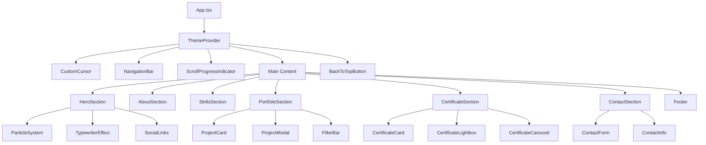
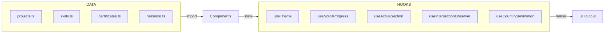

# Dokumen Desain: Personal Portfolio Website

## Overview

Web portofolio personal ini dirancang untuk seorang profesional multidisiplin yang ahli di bidang UI/UX Design, Web Development, App Development, dan Artificial Intelligence. Tujuan utama adalah membangun personal branding yang kuat dan menarik perhatian rekruter atau klien potensial.

Web ini dibangun sebagai **Single Page Application (SPA)** berbasis **React + Vite** dengan pendekatan component-driven. Setiap bagian (section) adalah komponen React yang mandiri, dihubungkan oleh sistem navigasi smooth-scroll. Animasi dikelola oleh **Framer Motion** untuk animasi UI berbasis React, dan **tsParticles** untuk sistem partikel interaktif di Hero Section.

### Keputusan Desain Utama

| Keputusan | Pilihan | Alasan |
|---|---|---|
| Framework | React + Vite | Ekosistem luas, DX terbaik, build cepat |
| Styling | Tailwind CSS | Utility-first, konsistensi desain, dark mode mudah |
| Animasi | Framer Motion | API deklaratif, integrasi React native, scroll-triggered |
| Partikel | tsParticles | Interaktif cursor, performa baik, konfigurasi JSON |
| Form Email | EmailJS | Tanpa backend, gratis 200 email/bulan |
| Ikon | Lucide React | Konsisten, tree-shakeable, TypeScript-friendly |
| Carousel | Swiper.js | Fitur lengkap, responsif, aksesibel |

### Ringkasan Temuan Riset

- **Framer Motion** adalah pilihan terbaik untuk animasi UI di React: API deklaratif, mendukung `whileInView` untuk scroll-triggered animations, dan `AnimatePresence` untuk exit animations. Bundle size ~32KB gzipped. ([Sumber](https://www.dronahq.com/react-animation-libraries/))
- **tsParticles** adalah penerus aktif dari particles.js, mendukung interaksi kursor (repulse/attract), tersedia sebagai komponen React (`@tsparticles/react`). ([Sumber](https://coderpad.io/blog/development/interactive-animated-backgrounds-react-tsparticles/))
- **EmailJS** memungkinkan pengiriman email langsung dari frontend tanpa backend, dengan free tier 200 email/bulan. Kunci publik aman di frontend; kunci privat tidak boleh diekspos. ([Sumber](https://mailtrap.io/blog/emailjs-react/))
- Stack **Next.js + Tailwind CSS** adalah standar industri untuk portofolio developer modern, namun untuk SPA sederhana tanpa kebutuhan SSR/SEO berat, **React + Vite** lebih ringan dan cepat. ([Sumber](https://dev.to/deepeshjaindj/building-a-modern-portfolio-website-the-best-tech-stack-for-2024-4fh1))

---

## Architecture

Web portofolio ini menggunakan arsitektur **Component-Based SPA** dengan pemisahan yang jelas antara data, logika, dan presentasi.



### Alur Data



### Struktur Direktori

```
src/
├── components/
│   ├── layout/
│   │   ├── NavigationBar.tsx
│   │   ├── Footer.tsx
│   │   ├── ScrollProgressIndicator.tsx
│   │   ├── BackToTopButton.tsx
│   │   └── CustomCursor.tsx
│   ├── sections/
│   │   ├── HeroSection.tsx
│   │   ├── AboutSection.tsx
│   │   ├── SkillsSection.tsx
│   │   ├── PortfolioSection.tsx
│   │   ├── CertificateSection.tsx
│   │   └── ContactSection.tsx
│   └── ui/
│       ├── ParticleSystem.tsx
│       ├── TypewriterEffect.tsx
│       ├── SkillBar.tsx
│       ├── ProjectCard.tsx
│       ├── ProjectModal.tsx
│       ├── CertificateCard.tsx
│       ├── CertificateLightbox.tsx
│       ├── ContactForm.tsx
│       ├── AnimatedCounter.tsx
│       └── ThemeToggle.tsx
├── hooks/
│   ├── useTheme.ts
│   ├── useScrollProgress.ts
│   ├── useActiveSection.ts
│   ├── useIntersectionObserver.ts
│   └── useCountingAnimation.ts
├── data/
│   ├── projects.ts
│   ├── skills.ts
│   ├── certificates.ts
│   └── personal.ts
├── types/
│   └── index.ts
├── utils/
│   ├── colorUtils.ts
│   ├── validationUtils.ts
│   └── scrollUtils.ts
├── styles/
│   └── globals.css
└── App.tsx
```

---

## Components and Interfaces

### NavigationBar

Komponen sticky navigation yang selalu terlihat di atas layar. Menggunakan `useScrollProgress` untuk indikator scroll dan `useActiveSection` untuk menandai section aktif.

**Props:** Tidak ada (menggunakan context dan hooks internal)

**State:**
- `isScrolled: boolean` — apakah halaman sudah di-scroll melewati Hero
- `isMobileMenuOpen: boolean` — status menu hamburger
- `activeSection: string` — ID section yang sedang aktif

**Behavior:**
- Saat `isScrolled = true`: tambahkan `backdrop-blur` dan `bg-opacity-90`
- Saat lebar layar < 768px: sembunyikan nav links, tampilkan hamburger button
- Setiap nav link memiliki `onClick` yang memanggil `scrollToSection(id)`

---

### HeroSection

Section pertama yang terlihat. Berisi ParticleSystem, foto profil, nama, TypewriterEffect, tagline, CTA buttons, dan social links.

**Props:** Tidak ada

**Sub-components:**
- `ParticleSystem` — latar belakang partikel interaktif
- `TypewriterEffect` — animasi ketik jabatan bergantian
- `SocialLinks` — ikon tautan media sosial

---

### ParticleSystem

Wrapper komponen untuk `@tsparticles/react`. Dikonfigurasi dengan mode interaksi `repulse` pada hover kursor.

**Props:**
```typescript
interface ParticleSystemProps {
  className?: string;
}
```

**Konfigurasi tsParticles:**
- `interactivity.events.onHover.enable: true`
- `interactivity.events.onHover.mode: "repulse"`
- `interactivity.modes.repulse.duration: 0.1` (≤ 100ms response)
- Partikel: titik-titik kecil dengan opacity rendah, bergerak lambat

---

### TypewriterEffect

Komponen yang menampilkan daftar teks secara bergantian dengan efek ketik dan hapus.

**Props:**
```typescript
interface TypewriterEffectProps {
  texts: string[];          // daftar jabatan/teks yang ditampilkan bergantian
  typingSpeed?: number;     // ms per karakter saat mengetik (default: 80)
  deletingSpeed?: number;   // ms per karakter saat menghapus (default: 50)
  pauseDuration?: number;   // ms jeda setelah teks lengkap (default: 2000)
}
```

**Invariant:** Setiap teks dalam `texts` harus muncul dalam siklus yang berulang. Setelah teks terakhir, kembali ke teks pertama.

---

### SkillBar

Komponen visual untuk satu keahlian. Dianimasikan saat masuk viewport menggunakan Framer Motion `whileInView`.

**Props:**
```typescript
interface SkillBarProps {
  name: string;             // nama keahlian
  icon: string;             // URL atau nama ikon teknologi
  proficiency: number;      // 0-100, tingkat kemahiran
  category: SkillCategory;  // kategori keahlian
  tooltip?: string;         // informasi tambahan untuk tooltip
}
```

---

### ProjectCard

Kartu proyek dengan efek hover overlay. Mendukung lazy loading gambar.

**Props:**
```typescript
interface ProjectCardProps {
  project: Project;
  onOpenModal: (project: Project) => void;
}
```

**Behavior:**
- Gambar menggunakan `loading="lazy"` untuk lazy loading native
- Hover: overlay muncul dengan tombol "Lihat Detail" dan "Buka Tautan"
- Klik kartu atau tombol detail: panggil `onOpenModal(project)`

---

### ContactForm

Formulir kontak dengan validasi client-side dan integrasi EmailJS.

**Props:** Tidak ada (state dikelola internal)

**State:**
```typescript
interface FormState {
  name: string;
  email: string;
  subject: string;
  message: string;
}

interface FormErrors {
  name?: string;
  email?: string;
  subject?: string;
  message?: string;
}

type SubmitStatus = 'idle' | 'loading' | 'success' | 'error';
```

**Validasi:**
- `name`: wajib, minimal 2 karakter
- `email`: wajib, format email valid (regex RFC 5322 sederhana)
- `subject`: wajib, minimal 3 karakter
- `message`: wajib, minimal 10 karakter

---

### ThemeToggle & useTheme

Hook `useTheme` mengelola state tema dan menyimpannya di `localStorage`. Mendeteksi `prefers-color-scheme` saat pertama kali dimuat.

**Hook Return:**
```typescript
interface UseThemeReturn {
  theme: 'light' | 'dark';
  toggleTheme: () => void;
}
```

**Behavior:**
1. Cek `localStorage.getItem('theme')`
2. Jika tidak ada, cek `window.matchMedia('(prefers-color-scheme: dark)')`
3. Terapkan class `dark` pada `document.documentElement`
4. Toggle: ubah dari `'light'` ke `'dark'` atau sebaliknya

---

### AnimatedCounter

Komponen angka yang dianimasikan dari 0 ke nilai target saat masuk viewport.

**Props:**
```typescript
interface AnimatedCounterProps {
  target: number;           // nilai akhir
  duration?: number;        // durasi animasi dalam ms (default: 2000, max: 2000)
  suffix?: string;          // suffix seperti "+" atau "%"
}
```

**Invariant:** Nilai yang ditampilkan selalu dimulai dari 0 dan berakhir tepat di `target`.

---

## Data Models

### Personal Info

```typescript
// src/data/personal.ts
interface PersonalInfo {
  name: string;
  titles: string[];           // daftar jabatan untuk TypewriterEffect
  tagline: string;
  bio: string;
  profileImage: string;       // path ke foto profil
  cvUrl: string;              // path ke file PDF CV
  email: string;
  whatsapp: string;           // format: +62xxx
  social: {
    linkedin: string;
    github: string;
    [key: string]: string;    // platform lain yang relevan
  };
  stats: {
    projectsCompleted: number;
    yearsExperience: number;
    clients: number;
  };
  interests: Array<{
    label: string;
    icon: string;
  }>;
}
```

### Project

```typescript
// src/types/index.ts
type ProjectCategory = 'Web' | 'UI/UX' | 'Aplikasi' | 'AI';

interface Project {
  id: string;
  title: string;
  description: string;        // deskripsi singkat untuk kartu
  fullDescription: string;    // deskripsi lengkap untuk modal
  category: ProjectCategory;
  thumbnail: string;          // URL gambar pratinjau
  gallery: string[];          // array URL gambar untuk modal
  technologies: string[];     // daftar teknologi yang digunakan
  projectUrl?: string;        // URL live project (opsional)
  repoUrl?: string;           // URL repositori (opsional)
  challenges: string;         // tantangan yang dihadapi
  solutions: string;          // solusi yang diterapkan
  featured: boolean;          // apakah ditampilkan di tampilan awal
}
```

### Skill

```typescript
type SkillCategory = 'UI/UX Design' | 'Web Development' | 'Mobile/App Development' | 'Artificial Intelligence';

interface Skill {
  id: string;
  name: string;
  icon: string;               // URL ikon teknologi (devicons atau custom)
  proficiency: number;        // 0-100
  category: SkillCategory;
  tooltip?: string;           // deskripsi tambahan
}
```

### Certificate

```typescript
interface Certificate {
  id: string;
  name: string;
  issuer: string;             // nama penerbit, e.g. "Dicoding Indonesia"
  year: number;
  image: string;              // URL gambar sertifikat
  verificationUrl?: string;   // URL verifikasi resmi (opsional)
  featured: boolean;          // apakah ditampilkan prominan
}
```

### Navigation

```typescript
interface NavItem {
  id: string;                 // ID section yang dituju, e.g. "hero", "about"
  label: string;              // teks yang ditampilkan di nav
}

// Daftar nav items yang terdefinisi
const NAV_ITEMS: NavItem[] = [
  { id: 'hero', label: 'Beranda' },
  { id: 'about', label: 'Tentang' },
  { id: 'skills', label: 'Keahlian' },
  { id: 'portfolio', label: 'Portofolio' },
  { id: 'certificates', label: 'Sertifikat' },
  { id: 'contact', label: 'Kontak' },
];
```

### Theme

```typescript
type Theme = 'light' | 'dark';

// CSS Custom Properties yang terdefinisi dalam tema
interface ThemeColors {
  '--color-primary': string;      // warna aksen utama
  '--color-background': string;   // warna latar belakang
  '--color-surface': string;      // warna permukaan kartu/komponen
  '--color-text-primary': string; // warna teks utama
  '--color-text-secondary': string;
  '--color-border': string;
}
```

---

## Correctness Properties

*A property is a characteristic or behavior that should hold true across all valid executions of a system — essentially, a formal statement about what the system should do. Properties serve as the bridge between human-readable specifications and machine-verifiable correctness guarantees.*

### Property 1: Typewriter Cycle Completeness

*For any* non-empty list of title strings passed to `TypewriterEffect`, every string in the list must appear as the displayed text at some point during the animation cycle, and the cycle must repeat indefinitely.

**Validates: Requirements 1.11**

---

### Property 2: Navigation Completeness and Active State

*For any* list of defined navigation sections (`NAV_ITEMS`), the `NavigationBar` must render exactly one nav link per section, and when a section is the active section, its corresponding nav link must have the active CSS class applied.

**Validates: Requirements 2.3, 2.5**

---

### Property 3: Responsive Layout at All Breakpoints

*For any* defined breakpoint (320px, 768px, 1024px, 1440px), the rendered layout must not produce horizontal overflow, and at breakpoints below 768px the hamburger button must be visible while nav links must be hidden.

**Validates: Requirements 2.7, 8.6**

---

### Property 4: Skill Data Rendering Completeness

*For any* valid `Skill` object, the `SkillBar` component must render the skill name, a technology icon, and a proficiency indicator, and the skill must belong to one of the four defined `SkillCategory` values.

**Validates: Requirements 4.1, 4.2**

---

### Property 5: Project Card Rendering Completeness

*For any* valid `Project` object, the `ProjectCard` component must render the thumbnail image, title, description, list of technologies, and at least one action link (project URL or repo URL).

**Validates: Requirements 5.1**

---

### Property 6: Portfolio Filter Correctness

*For any* valid `ProjectCategory` filter value, after the filter is applied, all visible `ProjectCard` components must have a `category` field that matches the selected filter. When the "Semua" (All) filter is selected, all projects must be visible.

**Validates: Requirements 5.3**

---

### Property 7: Minimum Portfolio Count

*For any* render of `PortfolioSection` with the default "Semua" filter, the number of visible `ProjectCard` components must be greater than or equal to 6.

**Validates: Requirements 5.7**

---

### Property 8: Certificate Card Rendering Completeness

*For any* valid `Certificate` object, the `CertificateCard` component must render the certificate image, name, issuer, and year. Additionally, if and only if the certificate has a `verificationUrl`, the card must render a "Verifikasi" button. The total certificate count displayed in the section summary must equal the length of the certificates array.

**Validates: Requirements 6.1, 6.6, 6.7**

---

### Property 9: Contact Form Validation

*For any* combination of form field values where at least one required field (name, email, subject, message) is empty or where the email field contains an invalid email format, form submission must be prevented and a specific error message must be displayed beneath the offending field.

**Validates: Requirements 7.2, 7.3, 7.4**

---

### Property 10: Theme Toggle Correctness

*For any* current theme state (`'light'` or `'dark'`), invoking `toggleTheme()` must result in the opposite theme being applied to `document.documentElement` and persisted to `localStorage`.

**Validates: Requirements 8.3, 8.4**

---

### Property 11: Icon Library Consistency

*For any* icon element rendered across the entire application, all icons must originate from the same icon library (Lucide React), identifiable by a consistent component naming pattern.

**Validates: Requirements 8.8**

---

### Property 12: Accessibility Properties

*For any* `` element rendered in the application, it must have a non-empty `alt` attribute. *For any* interactive element (button, anchor, input), it must be keyboard-focusable (valid `tabIndex`). *For any* text/background color pair defined in the theme, the contrast ratio must be ≥ 4.5:1. *For any* interactive element and navigation landmark, it must have an appropriate `aria-label`, `aria-labelledby`, or semantic `role`.

**Validates: Requirements 9.5, 9.6, 9.7, 9.8**

---

### Property 13: Copyright Year Accuracy

*For any* render of the `Footer` component, the copyright year displayed must equal `new Date().getFullYear()`.

**Validates: Requirements 10.2**

---

### Property 14: Counting Animation Correctness

*For any* valid non-negative integer `target` passed to `AnimatedCounter`, the animation must start from 0 and end at exactly `target`, and the animation duration must not exceed 2000ms.

**Validates: Requirements 3.3, 3.4**

---

### Property 15: Color Palette Consistency

*For any* color value used in component styles, the color must be defined as a CSS custom property (CSS variable) in the theme definition, ensuring all colors are sourced from the centralized palette.

**Validates: Requirements 8.1**

---

## Error Handling

### Strategi Umum

Semua error ditangani secara graceful — web tidak boleh crash atau menampilkan blank screen akibat error yang dapat diprediksi.

### Error Boundary

Setiap section utama dibungkus dengan React `ErrorBoundary` yang menampilkan fallback UI sederhana jika terjadi runtime error pada komponen tersebut, tanpa mempengaruhi section lain.

```typescript
// Contoh penggunaan
<ErrorBoundary fallback={<SectionErrorFallback sectionName="Portfolio" />}>
  <PortfolioSection />
</ErrorBoundary>
```

### Penanganan Error per Komponen

| Komponen | Skenario Error | Penanganan |
|---|---|---|
| `ParticleSystem` | tsParticles gagal inisialisasi | Tampilkan latar belakang gradient statis sebagai fallback |
| `ContactForm` | EmailJS gagal mengirim | Tampilkan pesan error "Gagal mengirim pesan. Silakan coba lagi atau hubungi via email langsung." |
| `ContactForm` | Validasi gagal | Tampilkan pesan error spesifik di bawah field yang bermasalah dalam ≤ 200ms |
| `ProjectCard` | Gambar gagal dimuat | Tampilkan placeholder image dengan ikon dan teks "Gambar tidak tersedia" |
| `CertificateCard` | Gambar gagal dimuat | Tampilkan placeholder image |
| `AnimatedCounter` | `target` bukan angka valid | Tampilkan nilai `target` langsung tanpa animasi |
| `TypewriterEffect` | `texts` array kosong | Tampilkan string kosong, tidak crash |
| `useTheme` | `localStorage` tidak tersedia | Fallback ke deteksi `prefers-color-scheme` atau default `'light'` |

### Validasi Data

Data statis (projects, skills, certificates) divalidasi saat build time menggunakan TypeScript strict mode. Tidak ada data yang diambil dari API eksternal, sehingga tidak ada skenario network error untuk konten utama.

### Keamanan EmailJS

- Public key EmailJS disimpan di environment variable (`VITE_EMAILJS_PUBLIC_KEY`)
- Service ID dan Template ID disimpan di environment variable
- Tidak ada private key/access token yang diekspos di frontend
- Rate limiting ditangani oleh EmailJS (200 email/bulan pada free tier)

---

## Testing Strategy

### Pendekatan Dual Testing

Web portofolio ini menggunakan dua lapisan pengujian yang saling melengkapi:

1. **Unit & Component Tests** — menguji contoh spesifik, edge case, dan kondisi error
2. **Property-Based Tests** — menguji properti universal yang harus berlaku untuk semua input valid

### Framework dan Library

| Kebutuhan | Library |
|---|---|
| Test runner | **Vitest** |
| Component testing | **React Testing Library** |
| Property-based testing | **fast-check** |
| Accessibility testing | **jest-axe** |
| Visual regression | **Storybook + Chromatic** (opsional) |

### Unit & Component Tests

Unit test difokuskan pada:

- **Validasi form**: contoh spesifik (email kosong, format salah, semua field valid)
- **Logika filter**: filter "Web" menampilkan hanya proyek Web
- **Theme toggle**: klik toggle mengubah class `dark` pada `document.documentElement`
- **Scroll behavior**: klik nav link memanggil `scrollIntoView` dengan `behavior: 'smooth'`
- **Lazy loading**: gambar di luar viewport memiliki `loading="lazy"`
- **Social links**: semua link memiliki `target="_blank"` dan `rel="noopener noreferrer"`
- **CV download**: tombol unduh memiliki atribut `download` dan `href` ke file PDF

### Property-Based Tests

Library: **fast-check** (TypeScript-native, integrasi Vitest)

Setiap property test dikonfigurasi dengan minimal **100 iterasi** dan diberi tag komentar yang mereferensikan property di dokumen desain ini.

```typescript
// Tag format: Feature: personal-portfolio-website, Property N: <deskripsi singkat>
```

**Implementasi per Property:**

**Property 1 — Typewriter Cycle Completeness**
```typescript
// Feature: personal-portfolio-website, Property 1: Typewriter cycle completeness
it('setiap teks dalam daftar harus muncul dalam siklus typewriter', () => {
  fc.assert(
    fc.property(
      fc.array(fc.string({ minLength: 1 }), { minLength: 1, maxLength: 10 }),
      (texts) => {
        // Simulasikan siklus typewriter dan verifikasi setiap teks muncul
        const cycle = simulateTypewriterCycle(texts);
        return texts.every(text => cycle.includes(text));
      }
    ),
    { numRuns: 100 }
  );
});
```

**Property 6 — Portfolio Filter Correctness**
```typescript
// Feature: personal-portfolio-website, Property 6: Portfolio filter correctness
it('filter kategori hanya menampilkan proyek dengan kategori yang sesuai', () => {
  fc.assert(
    fc.property(
      fc.array(arbitraryProject(), { minLength: 1, maxLength: 20 }),
      fc.constantFrom('Web', 'UI/UX', 'Aplikasi', 'AI'),
      (projects, category) => {
        const filtered = filterProjects(projects, category);
        return filtered.every(p => p.category === category);
      }
    ),
    { numRuns: 100 }
  );
});
```

**Property 9 — Contact Form Validation**
```typescript
// Feature: personal-portfolio-website, Property 9: Contact form validation
it('form dengan field kosong atau email tidak valid harus ditolak', () => {
  fc.assert(
    fc.property(
      arbitraryInvalidFormData(),
      (formData) => {
        const errors = validateContactForm(formData);
        return Object.keys(errors).length > 0;
      }
    ),
    { numRuns: 100 }
  );
});
```

**Property 12 — Accessibility: Alt Text**
```typescript
// Feature: personal-portfolio-website, Property 12: All images have non-empty alt text
it('semua elemen gambar harus memiliki atribut alt yang tidak kosong', () => {
  fc.assert(
    fc.property(
      fc.array(arbitraryProject(), { minLength: 1, maxLength: 10 }),
      (projects) => {
        const { getAllByRole } = render(<PortfolioSection projects={projects} />);
        const images = getAllByRole('img');
        return images.every(img => img.getAttribute('alt') && img.getAttribute('alt')!.trim().length > 0);
      }
    ),
    { numRuns: 100 }
  );
});
```

**Property 13 — Copyright Year Accuracy**
```typescript
// Feature: personal-portfolio-website, Property 13: Copyright year accuracy
it('tahun hak cipta harus selalu sama dengan tahun berjalan', () => {
  fc.assert(
    fc.property(
      fc.integer({ min: 2020, max: 2099 }),
      (year) => {
        vi.setSystemTime(new Date(year, 0, 1));
        const { getByText } = render(<Footer />);
        return getByText(new RegExp(String(year))) !== null;
      }
    ),
    { numRuns: 100 }
  );
});
```

### Integration Tests

Dijalankan secara terpisah (tidak dalam CI reguler karena memerlukan browser):

- **Lighthouse Performance**: skor ≥ 85 pada desktop
- **Lighthouse Accessibility**: skor ≥ 90
- **LCP (Largest Contentful Paint)**: ≤ 3 detik pada koneksi 10 Mbps
- **EmailJS**: verifikasi pengiriman email end-to-end di environment staging

### Aksesibilitas

Setiap komponen diuji dengan **jest-axe** untuk mendeteksi pelanggaran aksesibilitas secara otomatis:

```typescript
it('tidak ada pelanggaran aksesibilitas', async () => {
  const { container } = render(<ContactForm />);
  const results = await axe(container);
  expect(results).toHaveNoViolations();
});
```

> **Catatan**: Validasi aksesibilitas penuh memerlukan pengujian manual dengan assistive technologies (screen reader seperti NVDA/VoiceOver) dan review oleh ahli aksesibilitas. jest-axe hanya mendeteksi sebagian pelanggaran yang dapat dideteksi secara otomatis.

### Konfigurasi Test

```typescript
// vitest.config.ts
export default defineConfig({
  test: {
    environment: 'jsdom',
    setupFiles: ['./src/test/setup.ts'],
    globals: true,
  },
});
```

```typescript
// src/test/setup.ts
import '@testing-library/jest-dom';
import { configureAxe } from 'jest-axe';

// Konfigurasi fast-check global
import { configureGlobal } from 'fast-check';
configureGlobal({ numRuns: 100 });
```
